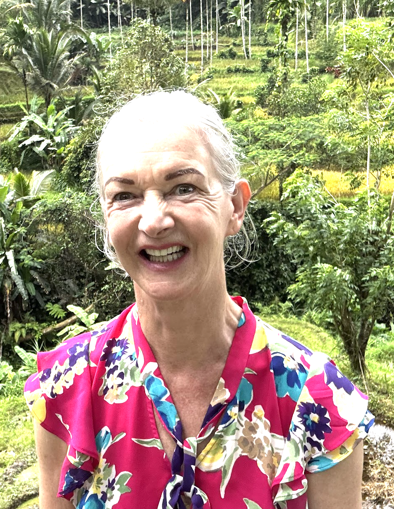

**MxSchons Tours**

*The invite-only travel agency for discerning adventurers*

---

\newpage

**A Personal Welcome from Your Host**

Dear Esteemed Travelers,

On behalf of **MxSchons Tours** — the world's most exclusive invite-only travel agency (membership: 5 people, waiting list: also 5 people) — I am absolutely thrilled to present to you this meticulously crafted journey to Hangzhou!

We have combined the best of the best to ensure you have an absolutely *legendary* experience. From soaring over West Lake in a helicopter (yes, really!) to picking tea leaves like ancient emperors, from watching 700,000 LEDs light up the night sky to getting lost in magical water towns — this trip has it all.

Our team of experts (me, with help from Claude) has spent countless hours researching the finest restaurants, the most photogenic spots, and the perfect balance of adventure and relaxation. We've thought of everything: vegetarian options for certain picky eaters, massage breaks for tired feet, and strategic cafe stops for Chinese study sessions.

This isn't just a trip. This is a *MxSchons Tours Experience™*.

Pack your bags. Charge your cameras. Prepare your appetites.

Hangzhou awaits!

With excitement and anticipation,

**Max**\
*Founder, CEO, and Chief Adventure Officer*\
*MxSchons Tours*

*P.S. — No refunds. You're family.*

---

\newpage

杭州家庭之旅

HANGZHOU FAMILY TRIP

◆

April 13 -- 27, 2026

*Ten Days Exploring West Lake, Tea Villages & Beyond*

**MAX • DION • MARGOT • ALEX & LYNN**

---

**Meet the Travelers**

| | | | | |
|:---:|:---:|:---:|:---:|:---:|
|  |  |  |  |  |
| **Max** | **Dion** | **Margot** | **Alex** | **Lynn** |
| Frankfurt | Singapore | Frankfurt | Singapore | Singapore |

---

**The Journey**

Frankfurt → Hangzhou → Wuzhen → Shanghai → Frankfurt

Singapore → Hangzhou → Wuzhen → Shanghai → Singapore

---

**Complete Journey Overview**

This trip brings the family together in Hangzhou from two directions: Max and Margot fly directly from Frankfurt, while Dion, Alex, and Lynn travel from Singapore. Everyone reunites in Hangzhou for the adventure, then travels together to Shanghai before parting ways.

  -------------- ------------------------------ ----------------------------------------------------------------
  **Date**       **Location**                   **Activity**

  Apr 13 (Mon)   Frankfurt → Hangzhou           Max + Margot fly direct to Hangzhou; arrive evening

  Apr 13 (Mon)   Singapore → Hangzhou           Dion + Alex & Lynn fly from Singapore; arrive evening

  Apr 13 (Mon)   Hangzhou                       Family reunion at hotel; late dinner together

  Apr 14--18     Hangzhou                       West Lake, tea picking, helicopter, G20 light show, local gems

  Apr 19 (Sun)   Hangzhou → Wuzhen → Shanghai   Scenic route via water town; arrive Shanghai evening

  Apr 20--21     Shanghai                       French Concession, The Bund, Huangpu cruise, Yu Garden

  Apr 22 (Wed)   Shanghai → Singapore           Dion + Alex & Lynn fly to Singapore

  Apr 22 (Wed)   Shanghai → Frankfurt           Max + Margot fly back to Frankfurt

  Apr 23 (Thu)   Frankfurt                      Max + Margot arrive home
  -------------- ------------------------------ ----------------------------------------------------------------

*Dion, Alex, and Lynn remain in Singapore after April 22.*

**Trip Overview**

**AT A GLANCE**

This ten-day journey brings together five family members across two generations to experience Hangzhou and Shanghai during peak spring season. The itinerary balances cultural depth, natural beauty, and modern China while accommodating different energy levels and interests.

  ------------------- -----------------------------------------------------------
  **Dates**           Monday, April 13 -- Wednesday, April 22, 2026 (China)

  **Full Journey**    April 13--27 including Singapore time + return to Germany

  **Travelers**       Max (DE), Dion (SG), Margot (DE), Alex & Lynn (SG)

  **Accommodation**   Wulin Jingyu Tingyuan Hotel --- Panorama Canal View Rooms

  **Weather**         21--22°C highs, 12--13°C lows, occasional spring rain

  **Dietary**         Options for vegan (Max); others omnivore

  **Est. Budget**     \~50,000 RMB total (\~\$6,800 USD) for all 5 people
  ------------------- -----------------------------------------------------------

**ACCOMMODATION**

**Wulin Jingyu Tingyuan Hotel**

A refined boutique hotel blending traditional Jiangnan architecture with modern comfort. Located in the historic Wulin district, the hotel features elegant courtyard gardens, tea lounges, and rooms designed with classical Chinese aesthetics. Prime location for exploring both West Lake and the Grand Canal area.

**HIGHLIGHTS**

- Tea Leaf Picking at Meijiawu Village --- Hands-on Longjing harvest during peak season

- Helicopter Flight Over Hangzhou --- Route D covering West Lake, pagodas, and Qiantang River

- Qiantang River Night Cruise --- G20 Summit light show with 700,000 LEDs

- Wuzhen Water Town --- Illuminated canals en route to Shanghai

- Shanghai Exploration --- French Concession, The Bund, Yu Garden, Huangpu River

- Gongyan Oriental Art Dinner --- Immersive Han Dynasty dinner theater

**Day-by-Day Itinerary**

**Day 1 --- Monday, April 13**

**ARRIVAL**

*A day of travel and reunion. The family converges on Hangzhou from two directions: Max and Margot fly direct from Frankfurt, while Dion, Alex, and Lynn travel from Singapore. Both groups arrive in the evening for an exciting reunion at the hotel and a late dinner together.*

  ------------------ --------------------------------------------------------------------------------------------
  **Time**           **Activity**

  Daytime            Max + Margot: Flight Frankfurt → Hangzhou (direct)

  Daytime            Dion + Alex & Lynn: Flight Singapore → Hangzhou

  Evening            Both groups arrive Hangzhou Xiaoshan Airport

  \~8:00 PM          Transfer to Wulin Jingyu Tingyuan Hotel; family reunion!

  9:30 PM            Late dinner at 新白鹿 (Xin Bailu) --- popular local chain, great intro to Hangzhou flavors
  ------------------ --------------------------------------------------------------------------------------------

*Pre-book separate airport transfers for each group (\~280--400 RMB each). Coordinate arrival times for smooth reunion. Xin Bailu has vegetarian options for Max.*

**Day 2 --- Tuesday, April 14**

**GENTLE START**

*A recovery day after the travel. Max gets his first Chinese class in while others relax. The afternoon brings everyone together for the classic West Lake experience and an easy introduction to Hangzhou street food at the night market.*

  ------------------ ---------------------------------------------------------------------------------
  **Time**           **Activity**

  9:00--10:30        Max: Chinese class at cafe. Margot relaxes; Alex & Lynn explore canal.

  11:00              Group reunites. West Lake lakeside promenade stroll.

  12:30              Lunch at 楼外楼 (Lou Wai Lou) --- Hangzhou\'s most famous restaurant since 1848

  14:30              City God Pagoda for panoramic views

  17:30              Wulin Night Market --- street food intro
  ------------------ ---------------------------------------------------------------------------------

*Lou Wai Lou: Try the legendary West Lake Vinegar Fish and Dongpo Pork. Tofu dishes available for Max. Cafe: 河下咖啡 (Hexia Coffee) --- canal-side, peaceful for study.*

**Day 3 --- Wednesday, April 15**

**NATURE & TEA**

*The signature Hangzhou nature day. Morning starts with the beloved Nine Creeks walk through bamboo groves and shallow streams, followed by the highlight: hands-on tea picking at Meijiawu during peak Longjing harvest season. The day culminates with an immersive Han Dynasty dinner theater.*

  ------------------ --------------------------------------------------------------------------------
  **Time**           **Activity**

  9:00--10:30        Max: Chinese class at Longjing village cafe

  11:00--13:00       Nine Creeks Meandering Walk --- shaded, scenic streams

  13:00              Lunch at 龙井草堂 (Longjing Caotang) --- garden restaurant in the tea village

  14:30--17:00       Tea Picking at Meijiawu --- picking, roasting, tasting (158 RMB/person)

  19:00              Dinner at Gongyan Oriental Art --- Han Dynasty dinner theater (498 RMB/person)
  ------------------ --------------------------------------------------------------------------------

*April is peak Longjing harvest (Yuqian grade). The Meijiawu experience includes drone aerial photos. Longjing Caotang specializes in tea-infused local dishes.*

**Day 4 --- Thursday, April 16**

**BIG EXPERIENCES**

*The most spectacular day of the trip. After a relaxed morning, the group takes a helicopter flight over West Lake for breathtaking aerial views. Evening brings the famous G20 Summit light show viewed from a river cruise --- 700,000 LEDs illuminating 35 buildings.*

  ------------------ ----------------------------------------------------------------------------------
  **Time**           **Activity**

  9:00--10:30        Max: Chinese class

  11:00--12:30       Group brunch at hotel or nearby cafe

  13:30              Depart for Xinlian Heliport (Xiaoshan District)

  14:30--16:00       Helicopter Flight --- Route D (\~25 min): West Lake, pagodas, river

  18:00              Early dinner at 知味观 (Zhiweiguan) --- famous for dim sum and Hangzhou classics

  19:30              Qiantang River Night Cruise --- Qianyin boat (168 RMB/person)

  20:30              G20 Light Show --- 700,000 LEDs on 35 buildings
  ------------------ ----------------------------------------------------------------------------------

*Helicopter: 2,580 RMB/person. Zhiweiguan (est. 1913): Try xiaolongbao, cat ear noodles, and shrimp-stuffed lotus root. Vegetable dumplings for Max.*

**Day 5 --- Friday, April 17**

**REST & LOCAL FLAVORS**

*A well-deserved rest day after the intensive helicopter and cruise day. Sleep in, enjoy a traditional breakfast, then indulge in affordable professional massages. Evening brings a special Hangzhou dining experience.*

  ------------------ -----------------------------------------------------------------------------
  **Time**           **Activity**

  Morning            Sleep in, relax at hotel

  11:00              Late brunch at 游埠豆浆 --- savory soy milk, fried dough, scallion pancakes

  Afternoon          Group Massage --- Yaoshi Blind Massage (\~50--100 RMB/person)

  Evening            Dinner at 外婆家 (Grandma\'s Home) --- beloved local chain, excellent value
  ------------------ -----------------------------------------------------------------------------

*Grandma\'s Home: Hugely popular for authentic home-style Hangzhou cooking. Try tea-smoked duck, braised pork belly, and stir-fried greens. Always has vegetable dishes. Expect a short wait --- worth it.*

**Day 6 --- Saturday, April 18**

**MORNING MARKET & LOCAL GEMS**

*An early start for the authentic morning market experience at Dama Long --- 240 meters of old Hangzhou charm that disappears by noon. The rest of the day is free for revisiting favorite discoveries or exploring new corners of the city.*

  ------------------ --------------------------------------------------------------------------------
  **Time**           **Activity**

  7:00               Morning Market --- Dama Long (大马弄) --- 240m of authentic local life

  9:00--10:30        Max: Chinese class at cafe

  11:00              Leisurely walk around Grand Canal scenic area

  12:30              Lunch at discovered favorite or hotel restaurant

  Afternoon          Flexible: Shopping, cafe hopping, or see Optional Activities

  19:00              Farewell Hangzhou dinner at 朴竹 Pu Zhu (Michelin Green Star) or favorite spot
  ------------------ --------------------------------------------------------------------------------

*Dama Long opens \~6:30 AM, busiest 7--9 AM. Try 葱包桧 at 胡阿姨葱包桧. Pu Zhu: Hangzhou\'s first Michelin Green Star --- elegant vegetarian fine dining if Max wants a special meal.*

**Day 7 --- Sunday, April 19**

**WUZHEN & SHANGHAI**

*A scenic travel day that doubles as an experience. The journey to Shanghai passes through the magical water town of Wuzhen --- perfectly positioned to catch the famous illuminated night scene before continuing to Shanghai for the final leg of the China adventure.*

  ------------------ -------------------------------------------------------------------------
  **Time**           **Activity**

  9:00               Check out of Wulin Jingyu Tingyuan Hotel; luggage in car

  9:30               Depart Hangzhou for Wuzhen (private car, \~1.5 hours)

  11:00              Arrive Wuzhen; store luggage at visitor center (free)

  11:30              Lunch in Wuzhen --- local noodles, rice cakes

  13:00--18:00       Explore Xizha (West Gate) --- canals, bridges, traditional architecture

  18:00              Lights come on at dusk --- Wuzhen\'s legendary illuminated scene

  20:00              Depart Wuzhen for Shanghai (\~1.5 hours)

  21:30              Arrive Shanghai; check into hotel; light supper nearby
  ------------------ -------------------------------------------------------------------------

*Wuzhen entry: 150 RMB. Vegan options limited --- try 定胜糕 (rice cake + red bean) and 青团 (green rice cakes). Max should bring backup snacks.*

**Day 8 --- Monday, April 20**

**SHANGHAI DAY 1**

*A full day exploring China\'s most cosmopolitan city. The morning wanders through the tree-lined boulevards and Art Deco architecture of the French Concession. Evening brings the magical experience of The Bund at sunset followed by a Huangpu River cruise.*

  ------------------ -------------------------------------------------------------------------------------
  **Time**           **Activity**

  9:00               Leisurely breakfast at hotel

  10:00--13:00       French Concession walk: Wukang Road → Fuxing Park → Tianzifang

  13:00              Lunch at Lost Heaven --- stunning Yunnan cuisine in a beautiful heritage building

  15:00--17:00       Shanghai Museum (free, air-conditioned) or continued exploration

  17:30              The Bund promenade --- sunset views, Pudong skyline

  19:00              Huangpu River Night Cruise (\~135 RMB, 45 min)

  21:00              Dinner at 上海老饭店 (Shanghai Lao Fandian) --- classic Shanghai cuisine since 1875
  ------------------ -------------------------------------------------------------------------------------

*Lost Heaven: Beautiful setting, excellent mushroom and vegetable dishes for Max. Shanghai Lao Fandian: Try hongshao rou (red-braised pork), drunken chicken, and crab dishes in season.*

**Day 9 --- Tuesday, April 21**

**SHANGHAI DAY 2**

*The final full day of the China adventure. Morning brings the historic Yu Garden at opening time before the crowds. The afternoon is flexible for last-minute shopping, exploring, or simply savoring the final hours in China.*

  ------------------ ----------------------------------------------------------------------------------------
  **Time**           **Activity**

  8:30               Early start --- head to Yu Garden area

  9:00               Yu Garden (豫园) --- arrive at opening for quietest experience (40 RMB)

  10:30              Brunch at 南翔馒头店 --- legendary xiaolongbao since 1900

  12:00              Explore Yu Garden Bazaar --- traditional shops, souvenirs

  Afternoon          Flexible: Nanjing Road shopping, more French Concession, or rest

  18:00              Final dinner at 功德林 (Godly Vegetarian) --- Shanghai\'s oldest vegetarian since 1922

  Evening            Pack, early night before morning flight
  ------------------ ----------------------------------------------------------------------------------------

*Nanxiang: The original xiaolongbao restaurant --- expect queues but worth it. Godly Vegetarian: A fitting final meal with both history and excellent food everyone can enjoy. Half-price Yu Garden entry for seniors 60+.*

**Day 10 --- Wednesday, April 22**

**FAREWELL & DEPARTURE**

*The final morning in China. After breakfast together, the family shares a bittersweet farewell at Pudong Airport before going separate ways: Dion, Alex, and Lynn head back to Singapore, while Max and Margot begin their long journey back to Frankfurt.*

  ------------------ ----------------------------------------------------
  **Time**           **Activity**

  6:30 AM            Wake up, final packing

  7:30 AM            Depart hotel for Pudong International Airport

  9:00 AM            Family farewell at airport

  Morning            Dion + Alex & Lynn: Flight Shanghai → Singapore

  Morning            Max + Margot: Flight Shanghai → Frankfurt

  Afternoon          Dion + Alex & Lynn arrive Singapore

  Next Day           Max + Margot arrive Frankfurt
  ------------------ ----------------------------------------------------

*Allow 2+ hours at Pudong Airport for international departure. Hotel near Pudong recommended for easiest morning.*

**Post-Trip**

**APRIL 22--23**

*The adventure concludes in Shanghai, where the family parts ways: Dion, Alex, and Lynn return to Singapore while Max and Margot fly back to Frankfurt. A bittersweet farewell after an unforgettable journey together.*

  ---------------------- ----------------------------------------------------------------------
  **Date**               **Activity**

  Wed, Apr 22            Dion + Alex & Lynn fly Shanghai → Singapore; arrive afternoon

  Wed, Apr 22            Max + Margot fly Shanghai → Frankfurt

  Thu, Apr 23            Max + Margot arrive Frankfurt
  ---------------------- ----------------------------------------------------------------------

**Optional Activities**

These experiences can be swapped into flexible afternoon slots or replace other activities based on the group\'s energy and interests.

**XIXI NATIONAL WETLAND PARK**

**China\'s First National Wetland Park**

A vast urban wetland just 5km from West Lake, Xixi offers a completely different Hangzhou experience --- peaceful waterways, traditional villages, and rich birdlife. The park inspired the classic phrase \'Xixi and West Lake, like two pearls of Hangzhou.\'

- Entry: 80 RMB (boat ride additional 60 RMB --- recommended)

- Duration: Half day (3--4 hours with boat)

- Getting there: Metro Line 3 or 19 to Xixi Wetland Station

- Best for: Nature lovers, photographers, escaping crowds

- Tip: The slow boat ride through the wetland channels is the highlight --- very peaceful

**HANGZHOU BAY ECO DAY TRIP**

**Wetlands, Wind Turbines & Coastal Scenery**

A full-day adventure combining nature and renewable energy installations. Best suited for those interested in eco-tourism and dramatic coastal landscapes.

- Hangzhou Bay National Wetland Park --- eco-education center with solar/wind/geothermal

- Cixi Coastal Wind Road --- drive beneath 33 massive wind turbines

- Duration: Full day (1.5--2 hour drive each way)

- Best for: Those wanting a break from historic sites

**LINGYIN TEMPLE**

**One of China\'s Largest Buddhist Temples**

A magnificent 1,700-year-old temple complex set against forested hills, with the remarkable Feilai Peak Buddhist carvings. A deeply atmospheric spiritual experience.

- Entry: 75 RMB (Feilai Peak) + 30 RMB (Temple)

- Duration: Half day (2--3 hours)

- Lunch nearby: Dayin Qingxin vegetarian buffet (30 RMB) --- temple food tradition

- Best for: Those interested in Buddhist culture and forest settings

**FAMILY PHOTOSHOOT**

**Professional Photography in Hangzhou**

Hangzhou offers stunning backdrops for professional family photos. Consider two separate mini-sessions to capture both sides of the family.

- Session 1: Max + Margot --- mother-son portraits at West Lake or tea plantations

- Session 2: Dion + Alex & Lynn --- family portraits, perhaps with Hanfu (traditional dress)

- Locations: West Lake, Longjing Tea Village, Wuzhen, Grand Canal

- Cost: Basic session 500--1,000 RMB; Hanfu package 800--2,000 RMB/person

- Booking: Search \'杭州旅拍\' on Xiaohongshu/Dianping; book 1--2 weeks ahead

**Restaurant Guide**

A mix of legendary establishments, local favorites, and vegetarian options. Reservations recommended for dinner at popular spots.

**HANGZHOU CLASSICS**

  --------------------------- -------------------------------------------------------- --------------------
  **Restaurant**              **Specialty**                                            **Price**

  楼外楼 Lou Wai Lou          West Lake Vinegar Fish, Dongpo Pork --- est. 1848        150--250/person

  知味观 Zhiweiguan           Dim sum, xiaolongbao, cat ear noodles --- est. 1913      80--150/person

  外婆家 Grandma\'s Home      Home-style Hangzhou --- beloved local chain              60--100/person

  新白鹿 Xin Bailu            Popular local chain --- great value, diverse menu        50--80/person

  龙井草堂 Longjing Caotang   Tea-infused dishes --- garden setting in tea village     100--180/person

  宫宴 Gongyan Oriental Art   Han Dynasty dinner theater --- immersive experience      498/person

  朴竹 Pu Zhu                 Michelin Green Star --- elegant vegetarian fine dining   300--500/person
  --------------------------- -------------------------------------------------------- --------------------

**SHANGHAI HIGHLIGHTS**

  ------------------------- ----------------------------------------------------------- --------------------
  **Restaurant**            **Specialty**                                               **Price**

  Lost Heaven               Yunnan cuisine --- stunning heritage building               150--250/person

  上海老饭店 Lao Fandian    Classic Shanghai --- red-braised pork, crab --- est. 1875   120--200/person

  南翔馒头店 Nanxiang       Original xiaolongbao --- legendary since 1900               50--100/person

  功德林 Godly Vegetarian   Shanghai\'s oldest vegetarian --- est. 1922                 70--120/person
  ------------------------- ----------------------------------------------------------- --------------------

*All restaurants have some vegetarian options. Lou Wai Lou, Zhiweiguan, and Grandma\'s Home have good tofu and vegetable dishes for Max.*

**Budget Estimate**

All prices in RMB. Exchange rate: \~\$1 USD = 7.3 RMB

  -------------------------------------------- ---------------- --------- -----------------
  **Category**                                 **Per Person**   **×5**    **Total**

  **ACCOMMODATIONS**                                                      

  Wulin Jingyu Tingyuan Hotel (6 nights × 3 rooms)   \~700/night      ×3        12,600

  Shanghai hotel (3 nights × 3 rooms)          \~800/night      ×3        7,200

  **EXPERIENCES**                                                         

  Helicopter flight (Route D)                  2,580            ×5        12,900

  Qiantang River night cruise                  168              ×5        840

  Tea picking (Meijiawu)                       158              ×5        790

  Gongyan dinner theater                       498              ×5        2,490

  Wuzhen entry (full day)                      150              ×5        750

  Huangpu River cruise                         135              ×5        675

  Yu Garden entry                              40               ×5        200

  Massage sessions (2×)                        150              ×5        750

  **TRANSPORT**                                                           

  Airport transfer Hangzhou                    \~350            group     350

  Private car HZ→Wuzhen→Shanghai               \~1,200          group     1,200

  Local taxis/Didi (\~10 days)                 \~1,500          group     1,500

  **FOOD & DINING**                                                       

  Daily meals (\~180/day × 9)                  1,620            ×5        8,100
  -------------------------------------------- ---------------- --------- -----------------

**ESTIMATED TOTAL**

  ------------------------------------- ---------------------------------
  **Base Trip Total**                   \~50,000 RMB (\~\$6,800 USD)

  With Optionals (photoshoot + Xixi)    \~54,000 RMB (\~\$7,400 USD)

  **Per Person Average (base)**         \~\$1,360 USD / \~10,000 RMB
  ------------------------------------- ---------------------------------

*Excludes international flights. Budget can be reduced by \~12,000 RMB by skipping helicopter.*

**Practical Information**

**KEY CONTACTS**

  -------------------------- --------------------------------------------
  **Service**                **Contact**

  Tour Operator              John Wu: WhatsApp +86 135 6716 1784

  Tour Guide                 Dannie (from previous trip)

  Wulin Jingyu Tingyuan Hotel      To be confirmed

  Binjiang Pier (cruise)     +86-571-85178197
  -------------------------- --------------------------------------------

**BOOKING TIMELINE**

- 30 days before: Gongyan Oriental Art dinner reservation

- 15 days before: Photoshoot booking (if desired)

- 7 days before: Helicopter, cruise, Meijiawu tea experience

- 2--3 days before: Confirm all reservations, check weather for helicopter

**USEFUL PHRASES**

  -------------------------- ---------------------- ---------------------
  **English**                **Pinyin**             **Chinese**

  Lighter pressure           qīng yī diǎn           轻一点

  Harder pressure            zhòng yī diǎn          重一点

  Pure vegan                 chún sù                纯素

  No meat, fish, eggs        bù yào ròu, yú, dàn    不要肉、鱼、蛋

  This is delicious!         zhè ge hěn hǎo chī     这个很好吃
  -------------------------- ---------------------- ---------------------

**PACKING REMINDERS**

- Layers (15--23°C range, cooler evenings)

- Rain jacket or umbrella (7--14 rainy days typical in April)

- Comfortable walking shoes

- Power adapter (China: Type A/I, 220V)

- VPN installed (for Google, WhatsApp)

- WeChat and Alipay set up before arrival

- Backup vegan snacks for Max (Wuzhen especially)

◆

一路平安

*Safe Travels*

◆
